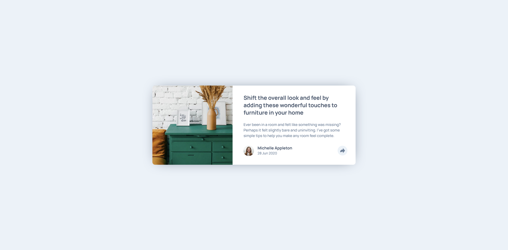
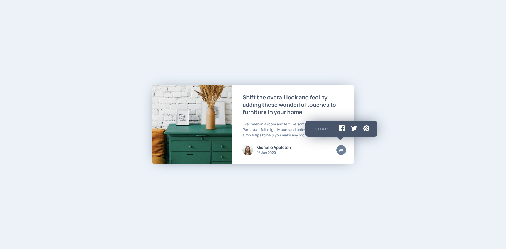
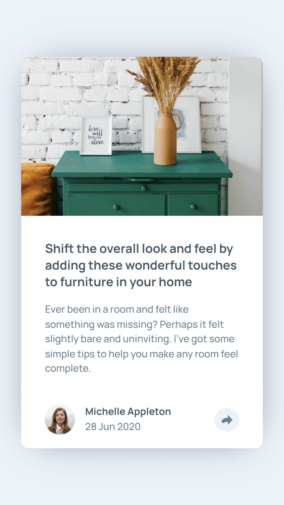
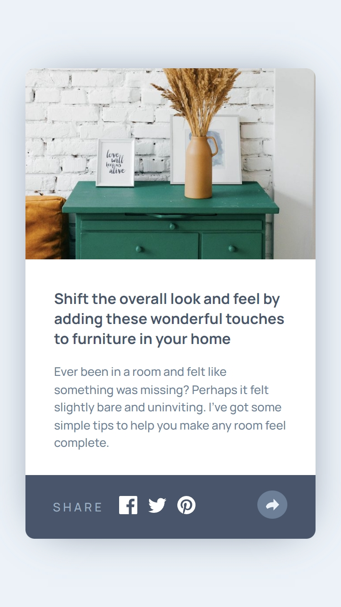

# Frontend Mentor - Article preview component solution

This is a solution to the [Article preview component challenge on Frontend Mentor](https://www.frontendmentor.io/challenges/article-preview-component-dYBN_pYFT). Frontend Mentor challenges help you improve your coding skills by building realistic projects.

## Table of contents

- [Overview](#overview)
  - [The challenge](#the-challenge)
  - [Screenshot](#screenshot)
  - [Links](#links)
- [My process](#my-process)
  - [Built with](#built-with)
  - [What I learned](#what-i-learned)
  - [Continued development](#continued-development)
- [Author](#author)
- [Acknowledgments](#acknowledgments)

## Overview

### The challenge

Users should be able to:

- View the optimal layout for the component depending on their device's screen size
- See the social media share links when they click the share icon

### Screenshot

### Links

- Solution URL: [Fronted Mentor](https://www.frontendmentor.io/solutions/flexbox-with-bem-names-variables-and-media-queries-h2loVogl5i)
- Live Site URL: [GitHub](https://orses.github.io/html-css/article_preview/)

## My process

### Built with

- Mobile-first workflow
- Semantic HTML5 markup
- BEM names for CSS class
- CSS custom properties
- Flexbox
- CSS variables
- CSS media queries
- JavaScript IIFE functions and event listener

### What I learned

- It has made me work all the time with the mobile in mind as the initial premise (mobile first workflow).
- The use of BEM to name CSS classes.
- Position an element (Share link) so that it is always visible, even if a component is called that by default occupies its place overlapping.

### Continued development

Develop the semantics of a card type component and make it perfectly accessible to screens, keyboards and screen readers.

## Author

- Frontend Mentor - [@orses](https://www.frontendmentor.io/profile/orses)

## Acknowledgments

Thanks to Frontend Mentor and all the people behind designing and creating challenges.
And thanks to everyone who participates giving their opinion on the projects of others.
