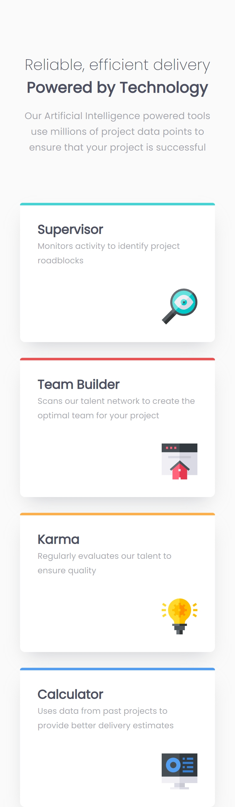
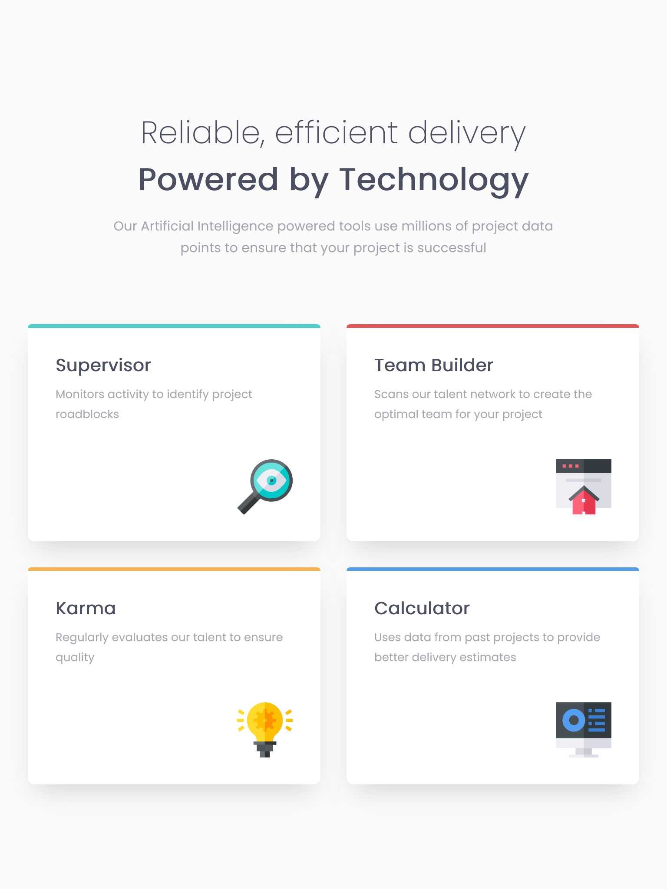
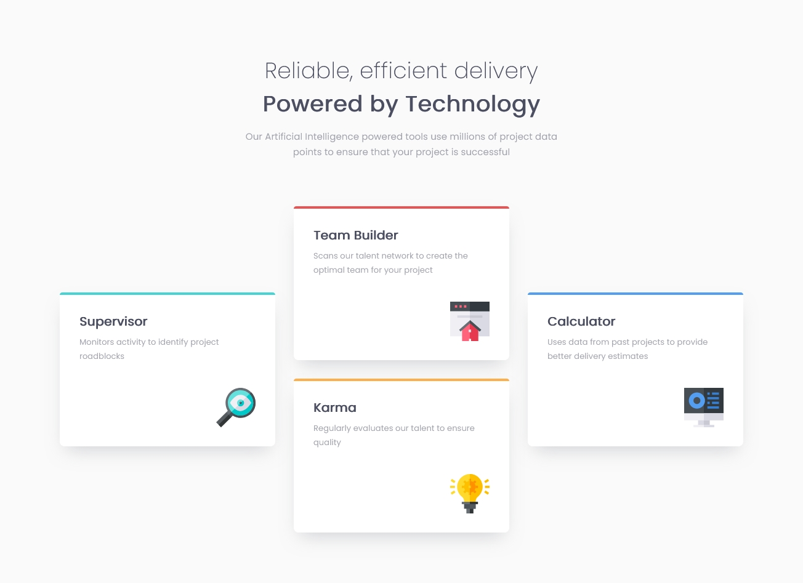

# Frontend Mentor - Four card feature section solution

This is a solution to the [Four card feature section challenge on Frontend Mentor](https://www.frontendmentor.io/challenges/four-card-feature-section-weK1eFYK). Frontend Mentor challenges help you improve your coding skills by building realistic projects.

## Table of contents

- [Overview](#overview)
  - [The challenge](#the-challenge)
  - [Screenshot](#screenshot)
  - [Links](#links)
- [My process](#my-process)
  - [Built with](#built-with)
  - [What I learned](#what-i-learned)
  - [Continued development](#continued-development)
- [Author](#author)
- [Acknowledgments](#acknowledgments)

## Overview

### The challenge

Users should be able to:

- View the optimal layout for the site depending on their device's screen size
- Two layouts: one column for mobile device and three columns for desktop

### Screenshot

### Links

- Solution URL: [Fronted Mentor](https://www.frontendmentor.io/solutions/responsive-layout-with-grid-WlZNOBbyaV)
- Live Site URL: [GitHub](https://orses.github.io/html-css/card_four_feature/)

## My process

### Built with

- Mobile-first workflow
- Semantic HTML5 markup
- BEM names for CSS class
- CSS custom properties
- Flexbox
- CSS Grid
- CSS variables

### What I learned

The development of grid has been interesting to adapt to responsive design with three types of layouts: for mobile, for tablet and desktop.
Also interesting is the use of CSS variables from the HTML code, to apply colors to the upper borders of the cards.
I continued with the practice of embedding local fonts in CSS.

### Continued development

Continue working with grid to see its potential and specify its applications.
Continue with inline svg files to work with their properties from CSS.

## Author

- Frontend Mentor - [@orses](https://www.frontendmentor.io/profile/orses)

## Acknowledgments

Thanks to Frontend Mentor and all the people behind designing and creating challenges.
And thanks to everyone who participates giving their opinion on the projects of others. It is good to hear other opinions and perspectives.
