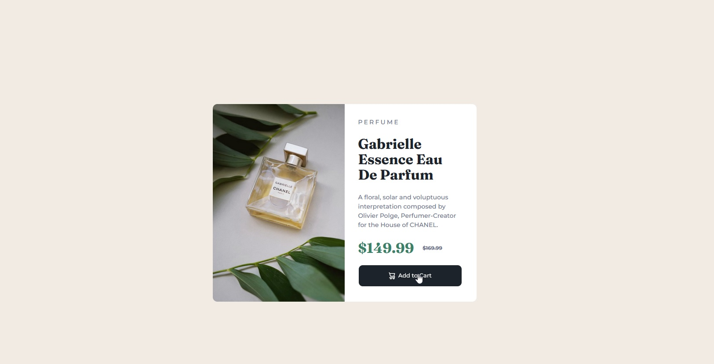

# Frontend Mentor - Product preview card component solution

This is a solution to the [Product preview card component challenge on Frontend Mentor](https://www.frontendmentor.io/challenges/product-preview-card-component-GO7UmttRfa). Frontend Mentor challenges help you improve your coding skills by building realistic projects.

## Table of contents

- [Overview](#overview)
  - [The challenge](#the-challenge)
  - [Screenshot](#screenshot)
  - [Links](#links)
- [My process](#my-process)
  - [Built with](#built-with)
  - [What I learned](#what-i-learned)
  - [Continued development](#continued-development)
  - [Useful resources](#useful-resources)
- [Author](#author)
- [Acknowledgments](#acknowledgments)

## Overview

### The challenge

Users should be able to:

- View the optimal layout depending on their device's screen size
- See hover and focus states for interactive elements

### Screenshot

### Links

- Solution URL: [Fronted Mentor](https://www.frontendmentor.io/solutions/responsive-card-using-media-queries-to-a-minimum-S86-8ov5Na)
- Live Site URL: [GitHub](https://orses.github.io/html-css/card_product_preview/)

## My process

### Built with

- Mobile-first workflow
- Semantic HTML5 markup
- BEM names for CSS class
- CSS custom properties
- Flexbox
- Every Layout design
- CSS variables
- CSS media queries

### What I learned

I have learned to think in Every Layout mode, and it has been quite a challenge to adapt it to this project. At all times I tried to use CSS without resorting to media queries and practically everything was fine.
The project required changing the images and padding of the text area, which ultimately made me have to use a media query.

### Continued development

I have tried to use Heydon Pickering's Every Layout way of designing and approaching responsive design. However, by trying to make it look a lot like the project, not everything can be applied in its entirety, but some components such as Cover, Center, Stack and Switcher can.
It is the first time that I use it and therefore I am not very confident that I have made a good approximation. I am interested in following this path.

### Useful resources

- [Excalidraw.com](https://excalidraw.com/) - This helped me think about the structure and visualize the component better, thus thinking about the classes to use.
- [Every Layout by Heydon Pickering](https://every-layout.dev/rudiments/boxes/) - I find this way of approaching CSS layout very interesting. It allows you to think in a more flexible way and without being so subject to the dimensions of the possible devices.

## Author

- Frontend Mentor - [@orses](https://www.frontendmentor.io/profile/orses)

## Acknowledgments

Thanks to Frontend Mentor and all the people behind designing and creating challenges.
And thanks to everyone who participates giving their opinion on the projects of others. It is good to hear other opinions and perspectives.
